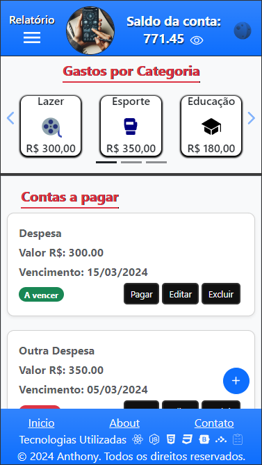

# My-Finance-App
[](https://github.com/anthony-steffen/my-finance-app/blob/main/LICENSE)


## Sobre o Projeto

Bem-vindo ao My-Finance-App, a solução elegante e intuitiva para o controle eficaz das suas finanças pessoais! Desenvolvido com a poderosa combinação de React.js e Vite, esta aplicação incorpora tecnologias modernas para garantir uma experiência fluida e agradável ao usuário.

Explore a versão online do projeto [aqui](https://anthony-steffen.github.io/my-finance-app/) para vivenciar pessoalmente a elegância e a praticidade que oferecemos.

### Destaques

- **Visual Elegante:** O design sofisticado do My-Finance-App proporciona uma experiência visual agradável e moderna durante todo o uso da aplicação.

- **Uso Intuitivo:** Desenvolvemos a interface pensando na simplicidade e na facilidade de uso, tornando a navegação e a interação com a aplicação intuitivas, mesmo para usuários iniciantes.

- **Controle Eficiente:** Registre despesas e receitas com facilidade, receba lembretes de contas a pagar e analise seus gastos por categoria de forma rápida e eficiente.


## Layout Mobile
<div>
  
  
  
</div>


## Layout Web
<div>
  

</div>


## Principais Tecnologias Utilizadas
<div align="center">
  
  
  
  
  
     
</div>
<br>

O My-Finance-App é construído com tecnologias de ponta para garantir desempenho, confiabilidade e uma experiência de usuário excepcional:

- **React.js e Vite:** Interfaces reativas e desenvolvimento ágil para uma aplicação responsiva e eficiente.

- **Context API e Hooks:** Gerenciamento avançado de estado para uma comunicação eficaz entre os componentes.

- **React Hook Form:** Simplificação e aprimoramento da validação de formulários.

- **React Toastify:** Notificações visuais personalizadas para uma interação mais informativa.

- **Bootstrap:** Estilização moderna e responsiva para uma experiência visualmente atraente.

- **React Router:** Navegação eficiente e intuitiva entre as diferentes seções da aplicação.

- **GitHub Pages:** Implantação em produção facilitada, garantindo uma integração direta com o GitHub e rápido acesso.

Explore o My-Finance-App e descubra como podemos tornar a gestão das suas finanças uma experiência elegante e intuitiva!

[Experimente agora!](https://anthony-steffen.github.io/my-finance-app/)


## Como Iniciar
Certifique-se de ter o Node.js instalado em seu sistema antes de prosseguir.

1. **Clone o repositório:**
    ```bash
    git clone https://github.com/seu-usuario/my-finance-app.git
    cd my-finance-app
    ```

2. **Instale as dependências:**
    ```bash
    npm install
    ```

3. **Inicie o servidor de desenvolvimento:**
    ```bash
    npm run dev
    ```

Acesse a aplicação em `http://localhost:3000` no seu navegador.

## Contribuições

Contribuições são bem-vindas! Se encontrar problemas, bugs ou tiver sugestões de melhorias, abra uma issue ou envie um pull request.

Agradecemos por usar o My-Finance-App!

## Autor

José Anthony Steffen de Oliveira

[LinkedIn](https://www.linkedin.com/in/anthony-steffen-dev/)
